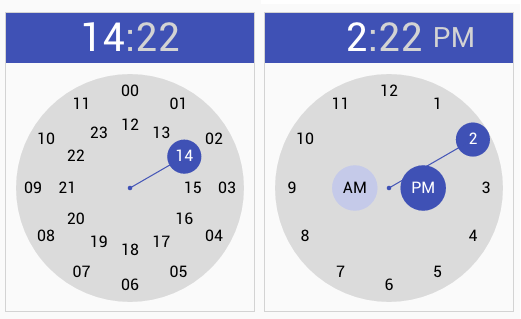

# zdkelt-time-picker

version : __2.0.0__

A time picker component 'à la' material design

This is a complete rewrite of the version 1, that doesn't work on firefox.

Example:

    <zdkelt-time-picker value="17:00"></zdkelt-time-picker>

> __Warning__ component does not yet support the meridiem hours, and is based only on 24-hour clock.

to get the API docs and demo consult http://zedesk.github.io/zdkelt-time-picker
